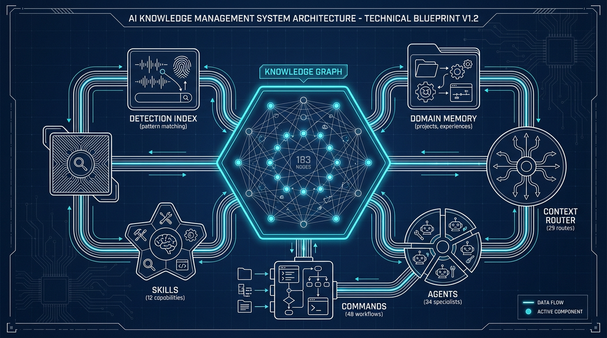

# Evolving - AI-Powered Second Brain & Development System

Ein hochoptimiertes System für **AI-First Development**, das Claude Code in einen Experten mit persistentem Gedächtnis, automatischer Kontextbereitstellung und kontinuierlichem Lernen verwandelt.



---

## Was macht dieses System besonders?

### Das Problem
Claude Code startet jede Session als "Amnesiac with Tool Belt" - brillantes Reasoning, aber null Erinnerung an vergangene Sessions, gelernte Lektionen oder Projekt-Kontext.

### Die Lösung
**Evolving** verwandelt Claude in einen **Disciplined Engineer** mit:

| Feature | Wirkung |
|---------|---------|
| **Domain Memory** | Persistenter Projekt-Status über Sessions hinweg |
| **Experience Memory** | Lernt aus vergangenen Fehlern & Erfolgen |
| **Context Router** | Lädt automatisch relevantes Wissen (31 intelligente Routes) |
| **Tiered Architecture** | 67% Token-Reduktion durch On-Demand Loading |
| **183 Knowledge Nodes** | Vernetztes Wissen mit 245 Beziehungen |
| **Autonomy Evolution** | Adaptive Autonomie basierend auf Task-Risiko & User-Skill |

---

## Effizienz: 67% Token-Einsparung

### Tiered Context Architecture

Statt 34K+ Tokens bei Session-Start:

```
OHNE Evolving:
┌─────────────────────────────────────────────────┐
│ Alles wird geladen: 34K+ Tokens                 │
│ CLAUDE.md + alle Rules + alle Patterns + ...    │
│ → Context Degradation, Lost-in-the-Middle       │
└─────────────────────────────────────────────────┘

MIT Evolving (Tiered Architecture):
┌─────────────────────────────────────────────────┐
│ CORE (~5K Tokens): Immer geladen                │
│ ├─ CLAUDE.md (kompakt)                          │
│ ├─ core-principles.md                           │
│ ├─ workflow-detection.md                        │
│ └─ domain-memory-bootup.md                      │
├─────────────────────────────────────────────────┤
│ ON-DEMAND: Context Router lädt bei Bedarf       │
│ ├─ debugging/   → nur bei Fehler-Keywords       │
│ ├─ memory/      → nur bei Memory-Arbeit         │
│ └─ creation/    → nur bei Agent/Skill Creation  │
└─────────────────────────────────────────────────┘

Ergebnis: ~5K statt 34K+ Tokens = 67% Ersparnis
```

### Wie es funktioniert

```
User-Input: "Ich habe einen TypeScript Error"
                    │
                    ▼
┌───────────────────────────────────────┐
│ Context Scout analysiert Keywords     │
│ → "error" → Route: debugging          │
└──────────────────┬────────────────────┘
                   │
                   ▼
┌───────────────────────────────────────┐
│ Context Router lädt automatisch:      │
│ ├─ pattern-systematic-debugging       │
│ ├─ rule-observe-before-editing        │
│ ├─ rule-evidence-before-claims        │
│ └─ agent-debugger (falls nötig)       │
└──────────────────┬────────────────────┘
                   │
                   ▼
      Claude hat präzisen Kontext
      (statt irrelevanter Masse)
```

---

## Die 5 Intelligenz-Layer

### 1. Domain Memory - Persistenter Projekt-Status

```json
// _memory/projects/evolving-system.json
{
  "name": "Evolving System",
  "state": {
    "current_phase": "Tiered Context Implementation",
    "last_session": "2026-01-02"
  },
  "progress": [
    {"d": "01-02", "a": "Context Router erweitert", "r": "29 Routes"}
  ],
  "failures": [
    {"what": "FAL.ai Edit API", "why": "image_urls muss Array sein", "learned": "Fix im Code"}
  ]
}
```

**Effekt**: Session startet mit: *"Projekt: Evolving | Phase: Tiered Context | Letzte Session: Gestern, Context Router erweitert auf 29 Routes"*

### 2. Experience Memory - Lernen aus Erfahrungen

6 Experience-Typen mit automatischem Decay:

| Typ | Beschreibung | Beispiel |
|-----|--------------|----------|
| `solution` | Problem + Lösung | "TypeScript Build Error → Interface erweitern" |
| `pattern` | Wiederverwendbarer Ansatz | "ICS Framework für Bildgenerierung" |
| `decision` | Architektur-Entscheidung | "LangGraph statt n8n für v2" |
| `workaround` | Temporärer Fix | "API Timeout → Retry mit Backoff" |
| `gotcha` | Bekannte Stolperfalle | "FAL.ai Edit: image_urls ist Array!" |
| `preference` | User-Präferenz | "Deutsch bevorzugt, Sparring-Stil" |

**Automatisches Decay**: Ungenutzte Experiences verlieren Relevanz (Halbwertszeit ~70-230 Tage je Typ). Aktiver Zugriff boosted Score.

### 3. Context Router - 31 Intelligente Routes

Automatische Kontextbereitstellung basierend auf Keywords:

```
"Ich möchte einen neuen Agent erstellen"
       │
       ▼
Route: agent-creation
       │
       ├─ Primary (sofort laden):
       │   ├─ template-specialist-agent
       │   ├─ template-research-agent
       │   └─ skill-template-creator
       │
       └─ Secondary (bei Bedarf):
           ├─ pattern-progressive-disclosure
           ├─ pattern-multi-agent-orchestration
           └─ learning-12-factor-agents
```

**Alle 31 Routes:**
agent-creation, planning, skill-creation, command-creation, research, idea-management, etsy, auswanderung, prompt-engineering, debugging, automation, orchestration, scenario-work, model-selection, knowledge-management, session-handoff, codebase-analysis, saas-business, system-creation, pitch-systems, macro-analysis, dashboard, security, browser, code-review, claude-workflow-patterns, pkm-digital-brain, ml-projects, image-generation, **autonomy**, **loop-iteration**

### 4. Knowledge Graph - Vernetztes Wissen

```
183 Nodes │ 245 Edges │ Unified Taxonomy

Beispiel-Verbindungen:
┌────────────────────┐       uses        ┌──────────────────────┐
│ agent-idea-        │──────────────────▶│ pattern-research-    │
│ validator          │                   │ confidence-scoring   │
└────────────────────┘                   └──────────────────────┘
        │                                          │
        │ part_of                                  │ documented_in
        ▼                                          ▼
┌────────────────────┐                   ┌──────────────────────┐
│ scenario-          │                   │ learning-agentic-    │
│ idea-management    │                   │ architectures        │
└────────────────────┘                   └──────────────────────┘
```

### 5. Autonomy Evolution - Adaptive Intelligenz

Das System klassifiziert jeden Task automatisch und wählt den passenden Autonomie-Modus:

```
┌─────────────────────────────────────────────────────┐
│              AUTONOMY CLASSIFIER                     │
└────────────────────┬────────────────────────────────┘
                     │
    ┌────────────────┼────────────────┐
    ▼                ▼                ▼
 AUTONOMOUS      SUPERVISED      INTERACTIVE
 (just do)      (do + report)    (ask first)
```

| Modus | Trigger | Beispiele |
|-------|---------|-----------|
| **AUTONOMOUS** | Lokal, reversibel, Tests vorhanden | Lint fixes, Formatting, Dependencies |
| **SUPERVISED** | Multi-File, mittlere Komplexität | Refactoring, Feature Implementation |
| **INTERACTIVE** | Production, Security, Architektur | Deployments, Schema-Änderungen |

**Paradox-Insight**: Bei niedrigem User-Skill → *mehr* Autonomie (AI soll handeln statt verwirren).

**Features:**
- User Skill Profiles pro Domain
- Correction Learning (passt sich an wenn User korrigiert)
- Auto-Delegation an Sub-Agents bei komplexen Tasks
- `/loop-until-done` Command für iterative Fixes

### 6. Progressive Disclosure - Wissen on Demand

```
Level 1: Summary (300 Tokens)
         ↓ bei Bedarf
Level 2: Reference (1000 Tokens)
         ↓ bei deep-dive
Level 3: Full Documentation (3000+ Tokens)

90% der Zeit reicht Level 1!
```

---

## Komponenten-Übersicht

| Komponente | Anzahl | Location |
|------------|--------|----------|
| **Commands** | 50 | `.claude/commands/` |
| **Agents** | 27 + 7 External | `.claude/agents/` |
| **Skills** | 6 + 6 External | `.claude/skills/` |
| **Patterns** | 52 | `knowledge/patterns/` |
| **Learnings** | 31 | `knowledge/learnings/` |
| **Rules** | 32 | `.claude/rules/` |
| **Blueprints** | 8 | `.claude/blueprints/` |
| **Scenarios** | 7 | `.claude/scenarios/` |
| **Templates** | 58 | `.claude/templates/` |
| **Agent Traits** | 480 | `knowledge/agents/` |
| **References** | 13 | `knowledge/references/` |
| **Graph Nodes** | 222 | `_graph/nodes.json` |
| **Graph Edges** | 293 | `_graph/edges.json` |
| **Context Routes** | 31 | `_graph/cache/context-router.json` |

---

## Key Features im Detail

### Auto-Detection: Natürliche Sprache → Commands

47 Commands per Plain-Text triggerbar. Beispiele:

| Du sagst... | System erkennt... |
|-------------|-------------------|
| "Ich habe eine neue Idee" | `/idea-new` (Confidence: 9/10) |
| "Verarbeite die Inbox" | `/inbox-process` |
| "Wie geht's weiter?" | `/whats-next` |
| "Analysiere dieses Repo" | `/analyze-repo` |
| "Erstelle ein Bild von..." | `/generate-image` |
| "Debug diesen Fehler" | `/debug` |

**Wichtig**: System fragt IMMER nach Bestätigung, führt nie blind aus.

### Session Handoff: Nahtlose Übergaben

```
Session 1: Arbeitet an Feature X
    │
    ▼
/whats-next erstellt Handoff:
    ├─ Was wurde erreicht
    ├─ Offene Tasks
    ├─ Key Decisions
    └─ Nächste Schritte
    │
    ▼
Session 2: Startet mit vollem Kontext
    "Letzte Session: Feature X zu 80% fertig.
     Nächster Schritt: Tests schreiben.
     Bekannter Blocker: API Timeout bei großen Requests."
```

### Clear, Don't Compact: Volle Signal-Qualität

```
PROBLEM bei Compaction:
Session Start → Arbeit → Compaction → Arbeit → Compaction
                              │                    │
                         10% Info-Loss        20% Info-Loss
                                                    │
                                            "Summary of Summary"
                                            → Halluzinationen

LÖSUNG mit Ledgers:
Session Start → Arbeit → Ledger Update → /clear → Fresh Context
                              │                        │
                         State gesichert        Volle Qualität
```

### Multi-Agent Orchestration

```
Komplexer Task
      │
      ▼
┌─────────────────────────────────────────────────┐
│ Main Agent koordiniert:                         │
│                                                 │
│   ┌──────────────┐   ┌──────────────┐          │
│   │ Explore      │   │ Research     │          │
│   │ Agent        │   │ Agent        │          │
│   │ (Codebase)   │   │ (Web)        │          │
│   └──────┬───────┘   └──────┬───────┘          │
│          │                   │                  │
│          └─────────┬─────────┘                  │
│                    ▼                            │
│            Summary zurück                       │
│            (~500 Tokens statt 10K)              │
└─────────────────────────────────────────────────┘
```

**Vorteil**: Jeder Sub-Agent hat eigenes 200K Context Window. Main bleibt schlank.

---

## Projekte

| Projekt | Status | Beschreibung |
|---------|--------|--------------|
| [AI Poster Creation Hub](knowledge/projects/ai-poster-creation-hub/README.md) | v4.0 Live | Viral-optimierte Etsy Listings |
| [Auswanderungs-KI v2](knowledge/projects/auswanderungs-ki-v2/README.md) | Production | 17-Agent Steuerberatungssystem |
| [Macro-Analyse](knowledge/projects/macro-analyse/README.md) | Live | WZRD-enhanced Market Intelligence |
| [NHIEN Bistro Order](knowledge/projects/nhien-bistro-order/README.md) | Live | QR-Based Ordering System |
| [Document Dashboard](knowledge/projects/document-dashboard/README.md) | MVP | RAG-powered Document Management |
| [Didit Medical Care](knowledge/projects/didit-medical-care/README.md) | Active | Medical Finance Dashboard |
| [Evolving Dashboard](knowledge/projects/evolving-dashboard/README.md) | Active | Command Center UI |
| Evolving System | Active | Dieses System |

---

## Quick Start

### Neue Session starten

```
@START.md
```

Claude liest automatisch:
1. `_memory/index.json` → Aktives Projekt
2. `_memory/projects/{active}.json` → Status, Progress, Failures
3. Announced: "Projekt X | Phase Y | Letzter Stand Z"

### Häufige Workflows

| Was du willst | Command |
|---------------|---------|
| Idee entwickeln | `/idea-new`, `/idea-work` |
| Wissen hinzufügen | `/knowledge-add` |
| Projekt analysieren | `/project-analyze` |
| Debugging | `/debug` |
| Session beenden | `/whats-next` |
| Bild generieren | `/generate-image` |
| System-Health | `/system-health` |

---

## Architektur

```
evolving/
├── START.md                 # User Entry Point
├── CLAUDE.md                # Kompakter System-Kontext
│
├── .claude/                 # Claude Code Integration
│   ├── commands/            # 48 Slash Commands
│   ├── agents/              # 34 Specialized Agents
│   ├── skills/              # 12 Progressive Skills
│   ├── rules/               # 28 Modular Rules
│   │   ├── *.md             # Core (immer geladen)
│   │   ├── on-demand/       # Bei Bedarf geladen
│   │   └── scenarios/       # Projekt-spezifisch
│   ├── blueprints/          # 8 System Templates
│   ├── scenarios/           # 7 Context Bundles
│   └── templates/           # 50 Component Templates
│
├── _memory/                 # Persistent State
│   ├── index.json           # Active Context
│   ├── projects/            # Project Memory
│   ├── experiences/         # Learning Memory
│   └── preferences/         # User Preferences
│
├── _graph/                  # Knowledge Graph
│   ├── nodes.json           # 222 Entities
│   ├── edges.json           # 293 Relationships
│   └── cache/
│       └── context-router.json  # 29 Auto-Routes
│
├── _ledgers/                # Session State
│   ├── CURRENT.md           # Active Ledger
│   └── archive/             # Completed
│
├── knowledge/               # Knowledge Base
│   ├── patterns/            # 52 Reusable Patterns
│   ├── learnings/           # 31 Documented Insights
│   ├── prompts/             # 25 Prompt Templates
│   ├── references/          # 13 Tool References
│   └── projects/            # 8 Project Docs
│
├── mcp_server/              # Claude Desktop Integration
├── dashboard/               # Next.js Command Center
└── ideas/                   # Idea Management
```

---

## MCP Server (Claude Desktop)

**45 Tools** für vollständige System-Integration in Claude Desktop:

- Domain Memory (5 tools)
- Experience Memory (6 tools)
- Knowledge Graph (6 tools)
- Agent Orchestration (5 tools)
- Scenario & Skills (6 tools)
- System Generation (8 tools)
- Ideas & Knowledge (9 tools)

**Kein API Key nötig!** Performance: 90%+ operations <500ms

→ Setup: [mcp_server/README.md](mcp_server/README.md)

---

## Dashboard Command Center

Vollständiges **Learning & Command Center** mit:

| Feature | Beschreibung |
|---------|--------------|
| **Command Palette** | `Cmd+K` öffnet globale Suche über 116+ Items |
| **Decision Tree** | "Was möchtest du tun?" → passende Commands |
| **Workflow Recipes** | 6 vordefinierte Workflows mit Copy All |
| **Learning Journey** | Progress-Tracking, Streak, Recommendations |
| **System Memory** | Echte Daten aus `_memory/` via API |
| **Health Checks** | Filesystem-Checks (KB, Ideas, Graph, Memory) |

---

## System-Philosophie

### 90% AI-Optimiert, 10% User-Facing

- **Für Claude**: Strukturierte JSON, Graph-Connections, Keyword-Routes
- **Für User**: START.md, Dashboard, natürliche Sprache

### Sparring > Ja-Sagen

System hinterfragt Annahmen, bietet Alternativen, ist radikal ehrlich.

### 80/20 Fokus

Was bringt wirklich Nutzen? Keine Over-Engineering.

### Single Source of Truth

Eine Quelle pro Konzept, keine Duplikation.

---

## Links

| Entry Point | Beschreibung |
|-------------|--------------|
| [START.md](START.md) | User Quick Start |
| [.claude/CONTEXT.md](.claude/CONTEXT.md) | Technical Deep Dive |
| [.claude/COMMANDS.md](.claude/COMMANDS.md) | All 48 Commands |
| [.claude/SYSTEM-MAP.md](.claude/SYSTEM-MAP.md) | Component Inventory |
| [knowledge/index.md](knowledge/index.md) | Knowledge Base Index |

---

## Version

**Version**: 3.3.0
**Last Updated**: 2026-01-05
**Status**: Production Ready

**Recent Changes**:
- v3.3.0: **Agent Template System** - 8 Agent Templates, Trait-basierte Composition (10×8×6 = 480 Kombinationen), `/compose-agent` Command, Voice Mappings, Disclaimers
- v3.2.0: **Autonomy Evolution System** - Adaptive 3-Tier Autonomie (AUTONOMOUS/SUPERVISED/INTERACTIVE), User Skill Profiles, Correction Learning, `/loop-until-done` Command, 200+ Bash Permissions
- v3.1.0: FAL.ai Image Generation, Tiered Context Architecture (67% Token Savings)
- v3.0.0: Dashboard Command Center, Learning Journey
- v2.0.0: MCP Server für Claude Desktop
- v1.0.0: Domain Memory, Experience Memory, Knowledge Graph

---

> *"The agent is just a policy that transforms one memory state into another."*
> *— Dieses System macht diese Transformation intelligent.*
